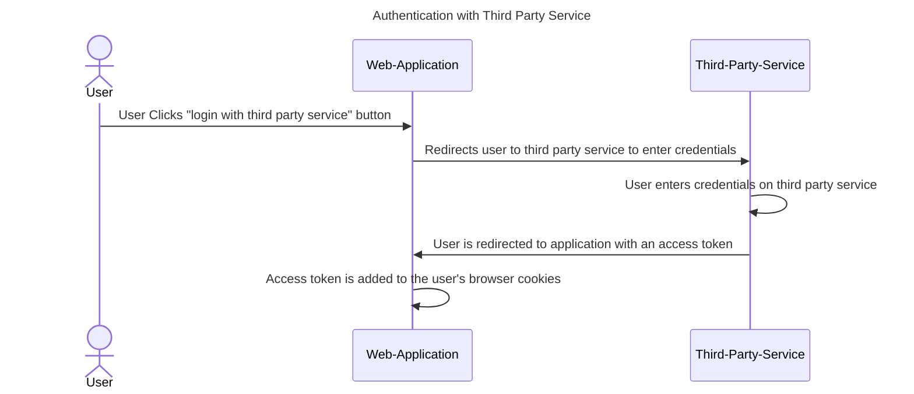

# 📑 Calendar – Technical Plan

## Authentication and Authorization

### Authentication
A user accesses the platform using an external auth provider. The application will have OAuth to allow users to use platforms like Google, Apple, Facebook, GitHub, etc to access their accounts.

These platforms will return an access token. The browser will use this access token to make subsequent requests to the Calendar backend services.

Calendar only requires the user's email details from the auth provider. A separate account/user/profile service handles things like first name, last name, profile picture, etc.

## Technology Stack

### Frontend:
- React + TypeScript (for modular, scalable, and type-safe UI)
- React Context API for client application state.
- React Query to sync server and client state
- TailwindCSS (for consistent and responsive styling)

### Testing:
- Vitest + React Testing Library (for frontend unit testing)
- Playwright for end-to-end testing

## Feature Breakdown and Module Design

### Core Modules

1. User Management
   - User profile creation, management, and preferences
   - Authentication using Firebase or Cognito
   - OAuth2 integration (e.g., Google login)

1. Calendar Events:
    - Create, edit, delete, and view events
    - Support for recurring events
    - Color-coding and categorization of events

1. Notifications & Reminders:
    - Email and push notifications for upcoming events
    - Real-time alerts using WebSockets

1. Sharing & Collaboration:
   - Share events with other users
   - Collaborate on shared schedules with permissions (view-only, edit access)

1. Calendar Views:
    - Daily, weekly, and monthly views
    - Toggle between multiple calendars (personal, work, shared)

## API Design and Endpoints

### Auth Service
`POST /auth/login`: Login and get a JWT token

`POST /auth/register`: Register a new user

### User Service
`GET /users/me`: Fetch user details

### Event Service
`POST /events` Create a new event

`GET /events/:id` Fetch details of an event

`PUT /events/:id` Update an existing event

`DELETE /events/:id` Delete an event

### Notification Service
`WS /notifications/:userId?token={token}` Listen for real-time notifications