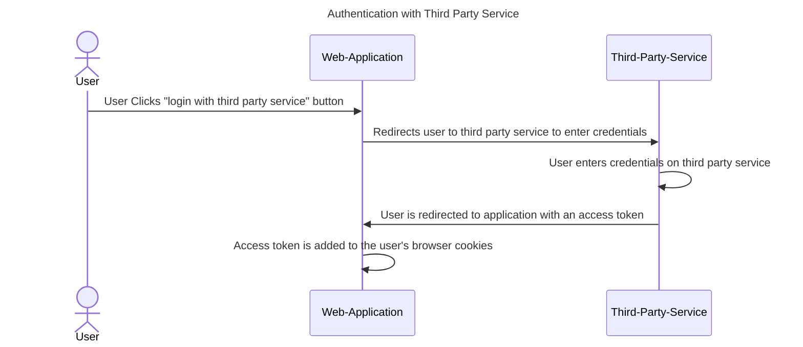

# 📑 Calendar – Technical Plan

## Authentication and Authorization

### Authentication
A user accesses the platform using an external auth provider. The application will have OAuth to allow users to use platforms like Google, Apple, Facebook, GitHub, etc to access their accounts.

These platforms will return an access token. The browser will use this access token to make subsequent requests to the Calendar backend services.

Calendar only requires the user's email details from the auth provider. A separate account/user/profile service handles things like first name, last name, profile picture, etc.

## Technology Stack

### Frontend:
- React + TypeScript (for modular, scalable, and type-safe UI)
- React Context API for client application state.
- React Query to sync server and client state
- TailwindCSS (for consistent and responsive styling)

### Testing:
- Vitest + React Testing Library (for frontend unit testing)
- Playwright for end-to-end testing
